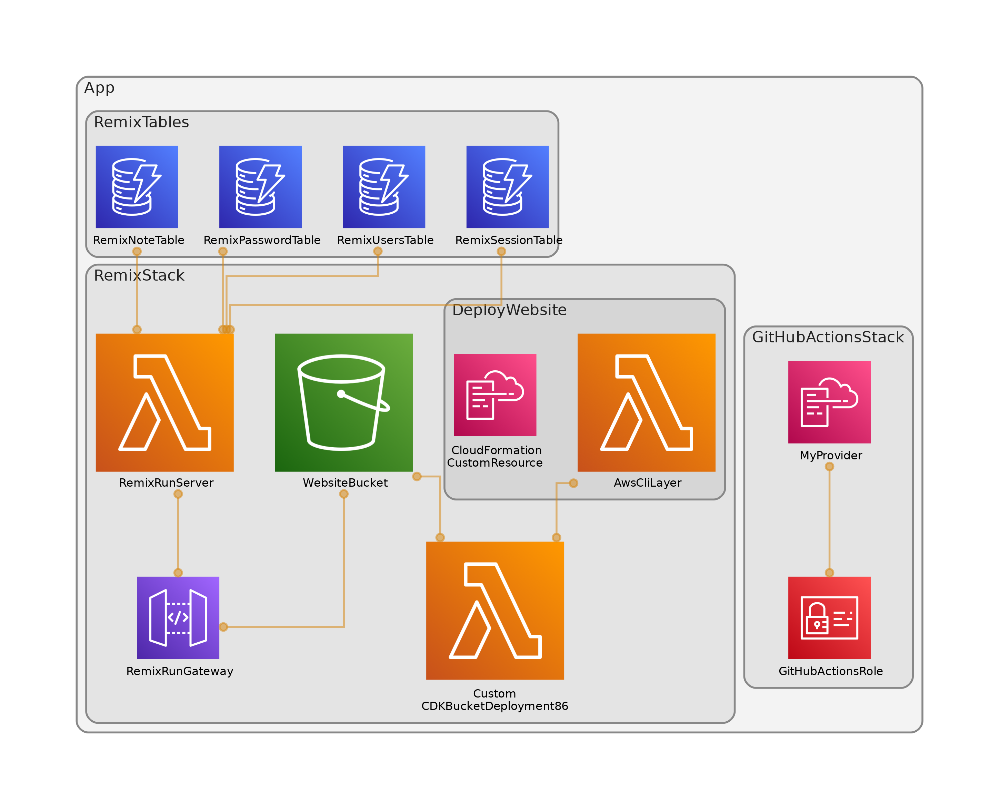

# Funk Stack

- [Funk Stack](#funk-stack)
  - [What's in the stack](#whats-in-the-stack)
  - [Architecture](#architecture)
  - [Development](#development)
    - [Relevant code](#relevant-code)
  - [Deployment](#deployment)
  - [Where do I find my CloudFormation?](#where-do-i-find-my-cloudformation)
  - [GitHub Actions](#github-actions)
  - [Testing](#testing)
    - [Cypress](#cypress)
    - [Vitest](#vitest)
    - [Type Checking](#type-checking)
    - [Linting](#linting)
    - [Formatting](#formatting)

Learn more about [Remix Stacks](https://remix.run/stacks).

```
npx create-remix --template simonireilly/funk-stack
```

## What's in the stack

- [AWS deployment](https://aws.com) with [Architect](https://docs.aws.amazon.com/cdk/v2/guide/getting_started.html)
- Production-ready [DynamoDB Database](https://aws.amazon.com/dynamodb/)
- [GitHub Actions](https://github.com/features/actions) for deploy on merge to production and staging environments
- Email/Password Authentication with [cookie-based sessions](https://remix.run/docs/en/v1/api/remix#createcookiesessionstorage)
- DynamoDB access via [`arc.tables`](https://arc.codes/docs/en/reference/runtime-helpers/node.js#arc.tables)
- Styling with [Tailwind](https://tailwindcss.com/)
- End-to-end testing with [Cypress](https://cypress.io)
- Local third party request mocking with [MSW](https://mswjs.io)
- Unit testing with [Vitest](https://vitest.dev) and [Testing Library](https://testing-library.com)
- Code formatting with [Prettier](https://prettier.io)
- Linting with [ESLint](https://eslint.org)
- Static Types with [TypeScript](https://typescriptlang.org)

Not a fan of bits of the stack? Fork it, change it, and use `npx create-remix --template your/repo`! Make it your own.

## Architecture

The diagram is provided by [cdk-dia](https://www.npmjs.com/package/cdk-dia).



## Development

- Validate the app has been set up properly (optional):

```sh
yarn validate
```

- Start dev server:

```sh
yarn dev
```

This starts your app in development mode, which hot reloads changes to AWS.

### Relevant code

This is a pretty simple note-taking app, but it's a good example of how you can build a full stack app with aws-cdk and Remix. The main functionality is creating users, logging in and out, and creating and deleting notes.

- creating users, and logging in and out [./app/models/user.server.ts](./app/models/user.server.ts)
- user sessions, and verifying them [./app/session.server.ts](./app/session.server.ts)
- creating, and deleting notes [./app/models/note.server.ts](./app/models/note.server.ts)

## Deployment

Deployments to AWS are managed by the AWS CDK.

```
yarn cdk deploy
```

## Where do I find my CloudFormation?

You can find the CloudFormation template that Architect generated for you in the sam.yaml file.

To find it on AWS, you can search for [CloudFormation](https://console.aws.amazon.com/cloudformation/home) (make sure you're looking at the correct region!) and find the name of your stack (the name is a PascalCased version of what you have in `app.arc`, so by default it's RemixPop-PunkStackStaging and RemixPop-PunkStackProduction) that matches what's in `app.arc`, you can find all of your app's resources under the "Resources" tab.

## GitHub Actions

We use GitHub Actions for continuous integration and deployment. Anything that gets into the `main` branch will be deployed to production after running tests/build/etc. Anything in the `dev` branch will be deployed to staging.

## Testing

### Cypress

We use Cypress for our End-to-End tests in this project. You'll find those in the `cypress` directory. As you make changes, add to an existing file or create a new file in the `cypress/e2e` directory to test your changes.

We use [`@testing-library/cypress`](https://testing-library.com/cypress) for selecting elements on the page semantically.

To run these tests in development, run `npm run test:e2e:dev` which will start the dev server for the app as well as the Cypress client. Make sure the database is running in docker as described above.

We have a utility for testing authenticated features without having to go through the login flow:

```ts
cy.login();
// you are now logged in as a new user
```

We also have a utility to auto-delete the user at the end of your test. Just make sure to add this in each test file:

```ts
afterEach(() => {
  cy.cleanupUser();
});
```

That way, we can keep your local db clean and keep your tests isolated from one another.

### Vitest

For lower level tests of utilities and individual components, we use `vitest`. We have DOM-specific assertion helpers via [`@testing-library/jest-dom`](https://testing-library.com/jest-dom).

### Type Checking

This project uses TypeScript. It's recommended to get TypeScript set up for your editor to get a really great in-editor experience with type checking and auto-complete. To run type checking across the whole project, run `npm run typecheck`.

### Linting

This project uses ESLint for linting. That is configured in `.eslintrc.js`.

### Formatting

We use [Prettier](https://prettier.io/) for auto-formatting in this project. It's recommended to install an editor plugin (like the [VSCode Prettier plugin](https://marketplace.visualstudio.com/items?itemName=esbenp.prettier-vscode)) to get auto-formatting on save. There's also a `npm run format` script you can run to format all files in the project.
